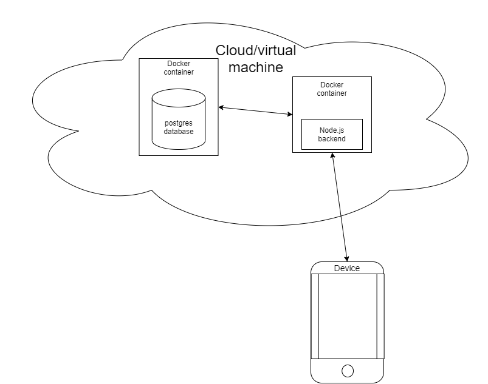

# OurChat

## Introduction

This is a project for TTOW0635 Mobile Project -course.

Project was made in group of three. I designed the database and coded the backend system.  
I also coded some frontend components ([ChatView-component](src/OurChat/app/components/ChatView)).

App made with:

- React Native
- NativeBase
- Node.js
- Express.js
- Sequelize
- Socket.io
- JWT
- PostgreSQL

[Backend endpoints documentation](./docs/endpoints.md).

## Introduction video

[https://youtu.be/Aum4JWdHMyw](https://youtu.be/Aum4JWdHMyw)

## Screenshots

[Screenshots folder](./docs/screenshots)

## Features

| Feature                   |       Status       |
| ------------------------- | :----------------: |
| Register new user         | :heavy_check_mark: |
| Login/Logout              | :heavy_check_mark: |
| Send and receive messages | :heavy_check_mark: |
| Dark theme                | :heavy_check_mark: |
| Group chats               | :heavy_check_mark: |

## Software architecture

## Database ER-Diagram

